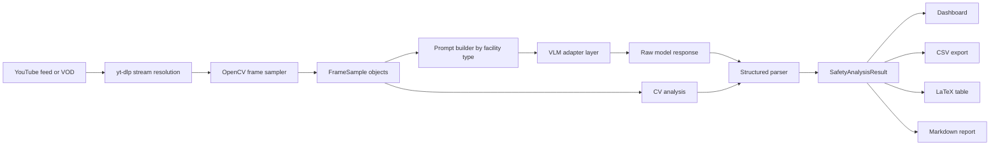

# VLM Traffic Safety Analyzer

Research-grade Streamlit application for multimodal traffic safety analysis from live streams and recorded video. The app samples frames from YouTube feeds, runs structured vision-language analysis through Gemini, OpenRouter, or Ollama, enriches results with lightweight computer vision metrics, and produces dashboard-ready outputs for transportation safety review.

## Overview

`VLM Traffic Safety Analyzer` is designed for exploratory roadway safety analysis where full trajectory extraction pipelines may be too heavy or unavailable. Instead of treating a vision-language model as a free-form assistant, the app constrains the model to emit a structured safety record aligned to a transportation-analysis schema. That record is then combined with conventional computer vision features and rendered into interactive charts, flat exports, and a narrative report.

The current implementation focuses on video-based observation workflows such as:

- freeway merge and weave sections
- exit ramps and barrier/crash-cushion areas
- lane-direction-control and contraflow operations
- roundabouts
- signalized and unsignalized intersections
- pedestrian and shared-use corridors
- general traffic stream monitoring

The prompt layer is aligned to FHWA, HSM, HCM, MUTCD, AASHTO Green Book, and related roadside/roundabout guidance embedded directly in the app.

## Key capabilities

- Multi-provider VLM inference through Gemini, OpenRouter, and local Ollama
- Direct YouTube ingestion for both live streams and VOD using `yt-dlp`
- Configurable frame sampling by interval and frame count
- Structured JSON parsing into a canonical `SafetyAnalysisResult`
- Lightweight CV augmentation with optical flow, edge density, motion energy, and spatial activity heatmaps
- Speed-limit resolution from model output, optional manual override, and OpenStreetMap fallback logic
- Interactive dashboard views with Plotly-based charts
- Export to CSV, LaTeX table, and Markdown executive report
- Multi-feed session workflow inside a single Streamlit UI

## System architecture



## Repository layout

```text
.
|-- app.py
|-- requirements.txt
|-- assets/
|   `-- style.css
`-- modules/
    |-- cv_analysis.py
    |-- ollama_utils.py
    |-- prompt_library.py
    |-- report_builder.py
    |-- safety_schema.py
    |-- speed_limit_lookup.py
    |-- video_engine.py
    `-- vlm_dispatcher.py
```

## Core modules

| Module | Responsibility |
|---|---|
| `app.py` | Streamlit UI, session state, feed management, execution flow, dashboard, and exports |
| `modules/video_engine.py` | YouTube stream resolution, metadata lookup, frame extraction, and base64 image packaging |
| `modules/vlm_dispatcher.py` | Unified provider adapters for Gemini, OpenRouter, and Ollama |
| `modules/prompt_library.py` | Facility-specific prompts and the embedded structured JSON contract |
| `modules/safety_schema.py` | Canonical dataclasses plus parser from raw model text to structured result |
| `modules/cv_analysis.py` | CPU-only CV features such as optical flow, edge density, and motion heatmaps |
| `modules/speed_limit_lookup.py` | Posted-speed reconciliation and fallback resolution logic |
| `modules/report_builder.py` | Plotly charts and export utilities for CSV, LaTeX, and Markdown |

## Analysis workflow

1. Select one or more traffic feeds.
2. Choose a provider and model.
3. Configure sampling interval, max frames, and optional scene context.
4. Sample frames from the source video.
5. Run CV analysis on the sampled frame set.
6. Send frames and facility-specific prompts to the selected multimodal model.
7. Parse the model output into a structured safety object.
8. Visualize the results in the dashboard and export tabular/report artifacts.

## Output schema

Each inference is normalized into a `SafetyAnalysisResult` object. Important fields include:

- identifiers: `result_id`, `session_id`, `video_label`, `video_url`
- facility metadata: `facility_type`, `provider`, `model_used`
- traffic state: vehicle counts, class breakdowns, estimated speeds, average speed, speed variance
- conflict analysis: conflict events, conflict count, dominant conflict type
- surrogate safety measures: TTC, PET, gap acceptance, deceleration rate
- infrastructure review: compliance observations and infrastructure condition
- composite indicators: safety score, severity index, conflict rate
- interpretive outputs: narrative summary, recommendations, cited manual references
- reproducibility fields: raw model response, parse-success flag, parser warnings

This structure makes the app easier to extend into downstream analytics, benchmarking, or paper-ready tables.

## Provider support

| Provider | Mode | Notes |
|---|---|---|
| Gemini | Hosted API | Uses `google-genai` with streaming output and multimodal inputs |
| OpenRouter | Hosted API | Uses OpenAI-compatible REST plus streaming support for vision models |
| Ollama | Local | Connects to a local Ollama host and supports locally available multimodal models |

## Dashboard and exports

The dashboard layer aggregates per-result records into research-oriented views, including:

- safety score timeline
- conflict distribution by severity
- speed histograms with posted-speed markers
- vehicle-count time series
- additional CV and scene-quality views from the report builder

Available exports:

- CSV for flat analysis records
- LaTeX table for papers and reports
- Markdown executive report for narrative review

## Installation

### Prerequisites

- Python 3.11 or newer
- `yt-dlp` available through the Python environment
- A supported provider:
  - Gemini API key, or
  - OpenRouter API key, or
  - local Ollama instance with a vision-capable model

### Local setup

```bash
git clone https://github.com/pozapas/traffic-safety-vlm.git
cd traffic-safety-vlm
python -m venv .venv
```

On Windows PowerShell:

```powershell
.venv\Scripts\Activate.ps1
pip install -r requirements.txt
Copy-Item .env.example .env
streamlit run app.py
```

On macOS or Linux:

```bash
source .venv/bin/activate
pip install -r requirements.txt
cp .env.example .env
streamlit run app.py
```

The app will typically be available at `http://localhost:8501`.

## Environment variables

Configure `.env` as needed:

```env
GEMINI_API_KEY=
OPENROUTER_API_KEY=
OLLAMA_HOST=http://localhost:11434
```

The UI also supports entering provider settings directly in the sidebar.

## Example usage

1. Launch the app with `streamlit run app.py`.
2. Pick `Gemini`, `OpenRouter`, or `Ollama`.
3. Add a YouTube traffic feed or use one of the seeded defaults.
4. Choose the facility type that best matches the scene.
5. Set frame interval and max frame count.
6. Run the analysis and review the dashboard and report tabs.

## Design choices

### Why structured VLM output

The project avoids free-form narrative-only outputs. Prompts require the model to return JSON conforming to the app schema, which makes downstream aggregation and export significantly more reliable.

### Why combine CV with VLM inference

The VLM contributes semantic reasoning, scene interpretation, and standards-referenced recommendations. The CV layer provides low-cost motion and scene-complexity signals that are deterministic, cheap to compute, and useful for comparison across feeds.

### Why Streamlit

The target workflow is rapid iteration by researchers, practitioners, and students rather than production-grade multi-user serving. Streamlit keeps the interface lightweight while making it easy to inspect intermediate artifacts.

## Limitations

- The app does not perform calibrated multi-object tracking or trajectory reconstruction.
- Speed estimates from image reasoning are approximate and should not be treated as legal-grade measurements.
- Model quality depends heavily on frame quality, camera angle, compression, lighting, and prompt-model fit.
- YouTube ingestion may be affected by regional restrictions, cookies, throttling, or source instability.
- Safety metrics are useful for screening and exploratory analysis, but not a replacement for field studies or validated conflict-measurement pipelines.

## Extending the project

Common extension points include:

- adding new facility-type prompts in `modules/prompt_library.py`
- adding new provider adapters in `modules/vlm_dispatcher.py`
- expanding charting and export logic in `modules/report_builder.py`
- replacing heuristic speed or conflict estimates with stronger CV models
- integrating lane geometry, map context, or metadata-driven calibration
